# Diagrama Entidad-Relación

Para entender las desiciones de lógia de negocios relacionadas con esta base de datos, véase [`contracts.md`](./contracts.md). Adicionalmente, las convenciones de nomenclatura aplicables a `Tablas DB` y `Columnas DB` viven en la sección **Convenciones de nomenclaturas** de [`contracts.md`](./contracts.md), por estar integradas en la tabla general de convenciones del proyecto.

## Convenciones del diagrama

- **Columnas estándar implícitas en TODAS las tablas** (no se repiten en el listado ni en el diagrama Mermaid para mantener legibilidad). Su definición canónica vive en la sección [Columnas estándar](#columnas-estándar).
- En el diagrama Mermaid y en la lista de entidades solo se listan las columnas de dominio y las FKs.
- Cardinalidades Mermaid:
  - `||--o{` = uno a muchos (lado "uno" obligatorio, lado "muchos" 0..N)
  - `||--|{` = uno a muchos (lado "muchos" 1..N obligatorio)
  - `}o--o{` = muchos a muchos (modelado vía tabla de relación)
- Todas las tablas de relación incluyen además las columnas estándar (`id`, `created_at`, `updated_at`, `deleted_at`) más las dos FKs de las entidades que relacionan.

## Diagrama

```mermaid
erDiagram
    %% =========================================================
    %% ENTIDADES PRINCIPALES (Tier 3)
    %% =========================================================
    PRODUCTOS {
        int marca FK
        string modelo
        int precio "centavos: 12999 = $129.99"
        string moneda "default MXN"
        int stock "default 0"
        json especificaciones "nullable"
    }

    LEADS {
        string chat_whatsapp_id "inmutable, indexado"
        string nombre_whatsapp
        string telefono "E.164, max 15 chars"
        string nombre "nullable"
        int ciudad FK "nullable"
        string direccion_envio "nullable"
        int intencion_de_compra FK
    }

    CHATS {
        int lead_id FK
        string chat_whatsapp_id "inmutable, indexado"
        int chat_status_id FK
        text resumen "nullable"
    }

    PRE_ORDENES {
        int lead_id FK
        int total "centavos"
    }

    %% =========================================================
    %% ENTIDADES DE DOMINIO CON FK
    %% =========================================================
    VEHICULOS {
        string modelo "UNIQUE(modelo,marca,anio)"
        int marca FK
        int anio
    }

    CIUDADES {
        string ciudad
        int estado FK
    }

    %% =========================================================
    %% CATÁLOGOS (no admiten delete - Tier 1 y Tier 2)
    %% =========================================================
    MARCAS {
        string marca
    }

    MONEDAS {
        string moneda
        string abreviacion
        int tipo_de_cambio "centavos vs MXN"
    }

    ESTADOS {
        string estado
        string abreviacion "nullable; resolución por sigla (p.ej. 'NL')"
    }

    INTENCIONES_DE_COMPRA_DE_LEADS {
        string tipo
    }

    CATEGORIAS {
        string categoria
    }

    CHAT_STATUSES {
        string status
    }

    %% =========================================================
    %% TABLAS DE RELACIÓN (Muchos a Muchos)
    %% =========================================================
    PRODUCTOS_VEHICULOS {
        int producto_id FK
        int vehiculo_id FK
    }

    PRODUCTOS_CIUDADES {
        int producto_id FK
        int ciudad_id FK
    }

    PRODUCTOS_CATEGORIAS {
        int producto_id FK
        int categoria_id FK
    }

    LEADS_PRODUCTOS {
        int lead_id FK
        int producto_id FK
    }

    LEADS_VEHICULOS {
        int lead_id FK
        int vehiculo_id FK
    }

    PRE_ORDENES_PRODUCTOS {
        int pre_orden_id FK
        int producto_id FK
        int cantidad "not null"
    }

    %% =========================================================
    %% RELACIONES 1:N (FK directas)
    %% =========================================================
    MARCAS                          ||--o{ PRODUCTOS                 : "fabrica"
    MARCAS                          ||--o{ VEHICULOS                 : "fabrica"
    MONEDAS                         ||--o{ PRODUCTOS                 : "denomina precio de"
    CIUDADES                        ||--o{ LEADS                     : "ubica a"
    ESTADOS                         ||--o{ CIUDADES                  : "agrupa"
    INTENCIONES_DE_COMPRA_DE_LEADS  ||--o{ LEADS                     : "clasifica"
    LEADS                           ||--o{ CHATS                     : "tiene (1 activo a la vez)"
    CHAT_STATUSES                   ||--o{ CHATS                     : "estado de"
    LEADS                           ||--o{ PRE_ORDENES               : "genera"

    %% =========================================================
    %% RELACIONES N:M (vía tablas de relación)
    %% =========================================================
    PRODUCTOS    ||--o{ PRODUCTOS_VEHICULOS     : "compatible con"
    VEHICULOS    ||--o{ PRODUCTOS_VEHICULOS     : "compatible con"

    PRODUCTOS    ||--o{ PRODUCTOS_CIUDADES      : "disponible en"
    CIUDADES     ||--o{ PRODUCTOS_CIUDADES      : "disponible en"

    PRODUCTOS    ||--o{ PRODUCTOS_CATEGORIAS    : "clasificado por"
    CATEGORIAS   ||--o{ PRODUCTOS_CATEGORIAS    : "clasifica a"

    LEADS        ||--o{ LEADS_PRODUCTOS         : "interesado en"
    PRODUCTOS    ||--o{ LEADS_PRODUCTOS         : "interesado en"

    LEADS        ||--o{ LEADS_VEHICULOS         : "posee"
    VEHICULOS    ||--o{ LEADS_VEHICULOS         : "poseído por"

    PRE_ORDENES  ||--|{ PRE_ORDENES_PRODUCTOS   : "contiene"
    PRODUCTOS    ||--o{ PRE_ORDENES_PRODUCTOS   : "ordenado en"
```

## Tablas de Entidades

A continuación se especifican las tablas de la base de datos. Todas heredan las [Columnas estándar](#columnas-estándar).

- productos
	- marca: FK, int
	- modelo: string
	- precio: int
	- moneda: string, default=MXN
	- stock: int, default=0
	- especificaciones: json | null ->{ "campo": "valor" }->{ "voltaje": "12V", "amperes_arranque_frio": "650 CCA" }
- leads
	- chat_whatsapp_id: string
	- nombre_whatsapp: string
	- telefono: string (formato E.164, máximo 15 caracteres)
	- nombre: string | null
	- ciudad: FK, int | null
	- direccion_envio: string | null
	- intencion_de_compra: FK, int
- chats
	- lead_id: FK, int
	- chat_whatsapp_id: string
	- chat_status_id: FK, int
	- resumen: text | null
- vehiculos
	- modelo: string
	- marca: FK, int
	- anio: int
- marcas
	- marca: string
- monedas
	- moneda: string
	- abreviacion: string
	- tipo_de_cambio (a pesos): int
- ciudades
	- ciudad: string
	- estado: FK, int
- estados
	- estado: string
	- abreviacion: string | null
- intenciones_de_compra_de_leads
	- tipo: string
- categorias
	- categoria: string
- chat_statuses
	- status: string
- pre_ordenes
	- lead_id: FK, int
	- total: int

### Tablas de relaciones

- productos_vehiculos (compatibilidades)
- productos_ciudades
- productos_categorias
- leads_productos
- leads_vehiculos
- pre_ordenes_productos

## Columnas estándar

Todas las tablas de la base de datos incluyen implícitamente las siguientes columnas, independientemente de que se mencionen o no:

| Columna | Tipo | Restricciones |
| --- | --- | --- |
| `id` | `int` | PK, not null |
| `created_at` | `timestamp` | not null |
| `updated_at` | `timestamp` | not null |
| `deleted_at` | `timestamp` | null |

## Valores por defecto

Las siguientes tablas deberán ser pobladas necesaria y estrictamente con los valores especificados a continuación en cada tabla respectivamente:

**monedas**

| id  | moneda          | abreviacion | tipo_de_cambio |
| --- | --------------- | ----------- | -------------- |
| 1   | Pesos Mexicanos | MXN         | 100            |
| 2   | Dólares         | USD         | 1700           |
| 3   | Euros           | EUR         | 2300           |

**intenciones_de_compra_de_leads**

| id | tipo |
| -- | ---- |
| 1 | baja |
| 2 | media |
| 3 | alta |
| 4 | completa |

**chat_statuses**

| id | status |
| -- | ------ |
| 1 | activo |
| 2 | en revisión |
| 3 | en espera |
| 4 | con cliente |
| 5 | cerrado |

**estados**

Catálogo fijo: las **32 entidades federativas de México**, cada una con su `abreviacion`. Se siembran de forma idempotente **por nombre** (sin ids fijos; autoincrement) y la `abreviacion` se rellena si faltara. Se resuelven por nombre o abreviación (normalizados) al crear ciudades.

| estado | abreviacion | estado | abreviacion |
| --- | --- | --- | --- |
| Aguascalientes | AGS | Morelos | MOR |
| Baja California | BC | Nayarit | NAY |
| Baja California Sur | BCS | Nuevo León | NL |
| Campeche | CAMP | Oaxaca | OAX |
| Chiapas | CHIS | Puebla | PUE |
| Chihuahua | CHIH | Querétaro | QRO |
| Ciudad de México | CDMX | Quintana Roo | QROO |
| Coahuila | COAH | San Luis Potosí | SLP |
| Colima | COL | Sinaloa | SIN |
| Durango | DGO | Sonora | SON |
| Estado de México | EDOMEX | Tabasco | TAB |
| Guanajuato | GTO | Tamaulipas | TAMPS |
| Guerrero | GRO | Tlaxcala | TLAX |
| Hidalgo | HGO | Veracruz | VER |
| Jalisco | JAL | Yucatán | YUC |
| Michoacán | MICH | Zacatecas | ZAC |

## Seeders

Las siguientes tablas se poblarán con valores aleatorios. Los valores a continuación son ejemplos de referencia:

| Tabla        | Valores de ejemplo                            |
| ------------ | --------------------------------------------- |
| `categorias` | baterías, cremalleras, balatas                |
| `ciudades`   | Monterrey (Nuevo León), Guadalajara (Jalisco) |
| `vehiculos`  | Versa, Sentra, Elantra                        |
| `marcas`     | Nissan, Hyundai, Honda, BYD, Tesla            |

## Notas técnicas

### Convenciones de tipado y nullabilidad

- Aquellas columnas cuyo tipado no especifique explícitamente con el valor "null", que pueden tener o no un valor (o que para el caso de una columna de llave foránea, indique que la entidad puede tener una o ninguna otra entidad) deben asumirse como `not_null` por defecto aunque no se indique explícitamente.

### Convenciones monetarias (centésimas)

- **Convención de almacenamiento de precio**: la columna `precio` de la tabla `productos` se almacena como `int` representando el monto en centavos (los últimos 2 dígitos del número son los centavos). Por ejemplo, `$129.99` se persiste como `12999`. Esta convención se mantiene durante todo el flujo interno y también en las respuestas de la API; el cliente que consume la API es responsable de formatear el valor a notación decimal cuando lo presente al usuario final. Esto evita errores de redondeo propios de los tipos flotantes.
- La columna `tipo_de_cambio` de la tabla `monedas` aplica la misma convención de centésimas (almacenada como `int`, donde los últimos 2 dígitos representan los centavos). Ejemplo: `1700` = 17.00 pesos por unidad de moneda extranjera.
- La columna `total` de la tabla `pre_ordenes` también sigue la convención de centésimas y se persiste en MXN (los precios de los productos en monedas distintas se convierten al momento de calcular el total usando `tipo_de_cambio`).

### Tablas de relación

- Todas las tablas de relación tienen además de las columnas estándar dos columnas de llaves foráneas de id de las entidades que relacionan.
- La tabla `pre_ordenes_productos`, deberá tener además de las columnas de llaves foráneas de "id" de las entidades que relaciona, una columna para la "cantidad" (de productos) ordenados para la orden correspondiente con tipo `int` y `not_null`.

### Reglas de catálogos

- Las tablas catálogo (`marcas`, `monedas`, `ciudades`, `estados`, `vehiculos`, `categorias`, `intenciones_de_compra_de_leads`, `chat_statuses`) **no admiten operaciones de delete** (ni soft ni hard). Sus registros se consideran constantes del sistema; nuevos valores solo se insertan cuando son requeridos por la creación de un producto u otra entidad principal.

### Reglas específicas de leads y chats

- La tabla `leads` sigue la convención estándar de `id: int` autogenerado. Adicionalmente incluye la columna `chat_whatsapp_id: string`, que se recibe al momento de la creación del lead y **nunca** se modifica. Un lead puede tener muchos chats, pero un chat solo puede tener un lead. Tanto leads como chats deben permitir búsqueda por `chat_whatsapp_id`.
- La tabla `chats` sigue la convención estándar de `id: int` autogenerado. Adicionalmente incluye la columna `chat_whatsapp_id: string`, que se recibe al momento de la creación del chat y **nunca** se modifica.
- Regla de negocio de chats: **solo puede existir un chat activo por lead a la vez**. Para crear un nuevo chat de un lead existente, el chat previo debe haber sido eliminado (soft delete) primero. Por esta razón, los endpoints de consulta de chats por `chat_whatsapp_id` o por `lead_id` deben retornar a lo sumo un único chat (el más reciente, ordenado por `created_at DESC LIMIT 1`).

### Reglas específicas de vehículos

- La tabla `vehiculos` debe tener un **constraint UNIQUE compuesto sobre `(modelo, marca, anio)`**. Esta tripleta identifica de forma única a un vehículo (ej. Versa Nissan 2015 ≠ Versa Nissan 2016). Esta unicidad es la que permite que las operaciones find-or-create sobre `vehiculos` sean deterministas.
- Como `vehiculos.anio` forma parte de la identidad de cada registro, la tabla `productos_vehiculos` queda automáticamente precisa por año: la compatibilidad de un producto puede declararse para un Versa Nissan 2010 sin afectar al Versa Nissan 2011.

### Formato de teléfono

- La columna `telefono` debe respetar el formato E.164 (máximo 15 caracteres, prefijo `+` y dígitos).

## Observaciones de revisión

Durante la revisión cruzada entre la sección de Base de datos y la sección de Endpoints de `contracts.md` se detectaron las siguientes inconsistencias y mejoras recomendadas. **Todas están ya resueltas o implementadas** en el código actual (las decisiones canónicas viven en `API-server/CLAUDE.md`); se conservan aquí como bitácora:

- **#1 FKs `_id`**: resuelto. El storage real usa `<entidad>_id` (`marca_id`, `moneda_id`, `ciudad_id`, `estado_id`, …); el diagrama y la lista de entidades muestran el nombre de dominio sin sufijo solo por convención de lectura del diagrama.
- **#2 `productos.moneda`**: resuelto → `moneda_id: FK int NOT NULL DEFAULT 1`; la respuesta devuelve `"moneda": "MXN"` (string por join).
- **#3 `pre_ordenes.total` en MXN**: resuelto → `total` se persiste en MXN ya convertido; no hay `pre_ordenes.moneda_id`.
- **#4 `Lead.chat_id` derivado** y **#6 `leads.estado` derivado**: confirmados → ambos son campos de respuesta calculados, no columnas (no existen `leads.chat_id` ni `leads.estado`/`estado_id`).
- **#5 `productos_interes` multi-match**: confirmado → find-or-skip **aditivo** por `modelo` (un modelo sin match en inventario se omite con aviso en header `Warning`, el lead se crea/edita igual; en `PATCH` combina con lo existente, no reemplaza); persiste todas las coincidencias en `leads_productos`.
- **#7 Índices**: implementados (índice en `leads.chat_whatsapp_id` y `chats.chat_whatsapp_id`, compuesto `chats (lead_id, created_at)`, UNIQUEs naturales en catálogos Tier 2, UNIQUE compuesto `vehiculos (modelo, marca_id, anio)`, UNIQUEs `(fk1, fk2)` en tablas de relación).
- **#8 Filtros en `GET /productos`**: implementado → el endpoint filtra por `categoria`, `ciudad`, `estado`, `vehiculo_modelo`/`vehiculo_marca`/`vehiculo_anio`, precio/stock/especificaciones, con orden y paginación (la lógica vive en `producto_service.search`).
- **#9 `PATCH /chats` inmutable**: confirmado → solo actualiza `chat_status_id` y `resumen`; `lead_id` y `chat_whatsapp_id` son inmutables.

Detalle original de cada observación (bitácora):

1. **Nombrado inconsistente de columnas FK entre tablas y endpoints**. La sección de entidades declara FKs sin sufijo (`marca`, `moneda`, `ciudad`, `intencion_de_compra`, `estado`), mientras que los bodies de endpoints las envían con sufijo `_id` (`moneda_id`, `intencion_de_compra_id`, `chat_status_id`, `lead_id`). Recomendación: unificar el nombrado a `<entidad>_id` en las tablas para que coincida con la convención de los endpoints y con el estándar SQL. Beneficio: SQLAlchemy mapea automáticamente sin renombramientos, y las queries se vuelven legibles sin tener que inferir tipo desde el nombre.

2. **`productos.moneda` declarada como `string, default=MXN` pero el body de `POST /productos` envía `moneda_id: int`**. Esto significa que el storage real debe ser `moneda_id: int FK → monedas.id`, y el `default=MXN` aplica únicamente a la respuesta de la API (string resuelto vía join). La declaración actual en la sección de entidades es ambigua y puede confundir al implementador. Recomendación: cambiar a `moneda_id: FK, int, default=1` (donde `1` es el id de MXN según los valores por defecto), y dejar el `"moneda": "MXN"` solo como contrato de respuesta.

3. **Falta `pre_ordenes.moneda_id` o aclaración explícita**. Las pre-órdenes pueden contener productos en monedas distintas (USD, EUR, MXN). La nota de endpoints dice que "todos los productos deben ser retornados por la API con precio en pesos mexicanos", lo que implica que `pre_ordenes.total` se persiste en MXN ya convertido. Conviene documentarlo explícitamente en la spec de la columna `total` (ya incluido en la sección de centésimas arriba) o, alternativamente, persistir `moneda_id` + `total` original sin conversión y resolver en el response. La primera opción ya está asumida en el diseño actual.

4. **`Lead.chat_id` en la respuesta del endpoint NO es una columna de la tabla `leads`**. Es un campo derivado/calculado: el `id` del chat activo más reciente del lead (consistente con la regla "1 chat activo por lead"). El modelo `LeadModel` debe resolverlo vía join a `chats` con `created_at DESC LIMIT 1` y `deleted_at IS NULL`. Importante no confundirlo con una FK adicional en `leads`.

5. **`leads.productos_interes[]` en respuestas y bodies vs tabla `leads_productos`**. El campo aparece en las respuestas como `[string]` (modelos de producto) y se persiste en la tabla intermedia `leads_productos` (FK a `productos.id`). La política documentada es find-or-skip **aditivo** por `productos.modelo`: un modelo que no exista en inventario no falla (no se crea producto, pero tampoco se rechaza el lead) — se omite y se reporta vía header `Warning` (éxito parcial, como ciudades); si la búsqueda retorna múltiples productos (ambigüedad de catálogo), se persiste la relación con todos los matches. En `PATCH` la vinculación es aditiva (combina con lo existente, nunca reemplaza ni borra; body vacío/omitido = sin cambios). Esto significa que `leads_productos` puede tener más filas que strings recibidos en el body. La orquestación vive en `lead_service.create/update` + `resolvers.resolver_productos_interes`.

6. **`leads.estado` derivado, no almacenado**. El endpoint dice que `estado` no se acepta en bodies de `/leads` porque se deriva de `ciudades → estados`. Por tanto, no hay (ni debe haber) columna `estado` ni `estado_id` en la tabla `leads`; el join transitivo `leads.ciudad → ciudades.estado → estados.estado` resuelve el campo de respuesta. Ya está reflejado correctamente en el diagrama.

7. **Índices recomendados (no documentados)** para soportar las búsquedas declaradas en endpoints:
   - `leads.chat_whatsapp_id` (búsqueda directa, `GET /leads?chat_whatsapp_id=`).
   - `chats.chat_whatsapp_id` (búsqueda directa, `GET /chats?chat_whatsapp_id=`).
   - `chats.lead_id` + ordenamiento por `created_at DESC` (para `get_by_lead` con LIMIT 1; un índice compuesto `(lead_id, created_at DESC)` con filtro parcial `WHERE deleted_at IS NULL` es óptimo).
   - Índices únicos sobre el campo natural de cada catálogo (`marcas.marca`, `categorias.categoria`, `ciudades.ciudad`, `estados.estado`, `monedas.abreviacion`) — necesarios para que la normalización determinista de Tier 2 (lowercase/trim/sin acentos) usada en find-or-create tenga garantía de unicidad a nivel BD y no solo a nivel aplicación.
   - Índice único compuesto en `vehiculos (modelo, marca, anio)` — ya documentado como constraint, pero conviene reiterar que el constraint UNIQUE crea automáticamente el índice que soporta find-or-create.
   - Índices únicos en las tablas de relación sobre el par `(fk1, fk2)` para evitar duplicados (ej. mismo producto compatible dos veces con el mismo vehículo).

8. **`GET /productos` no expone filtros por categoría, ciudad ni vehículo compatible** pese a que el modelo lo soporta vía las tablas de relación. Es probable que el chatbot LLM necesite filtrar por compatibilidad de vehículo (caso de uso principal: "¿qué baterías sirven para mi Versa 2015?"). Recomendación: añadir query params adicionales a `GET /productos` (`categoria`, `ciudad`, `vehiculo_modelo`, `vehiculo_marca`, `vehiculo_anio`) o, mejor, exponer un endpoint dedicado `GET /productos/compatibles?vehiculo_modelo=...&vehiculo_marca=...&vehiculo_anio=...`.

9. **`PATCH /chats/{id}` solo permite actualizar `chat_status_id` y `resumen`**. Esto confirma implícitamente que `lead_id` y `chat_whatsapp_id` son inmutables tras la creación del chat. Conviene declararlo explícitamente en las notas de la tabla `chats` y, a nivel BD, considerar marcarlos con triggers o validación a nivel ORM para impedir UPDATEs accidentales.
