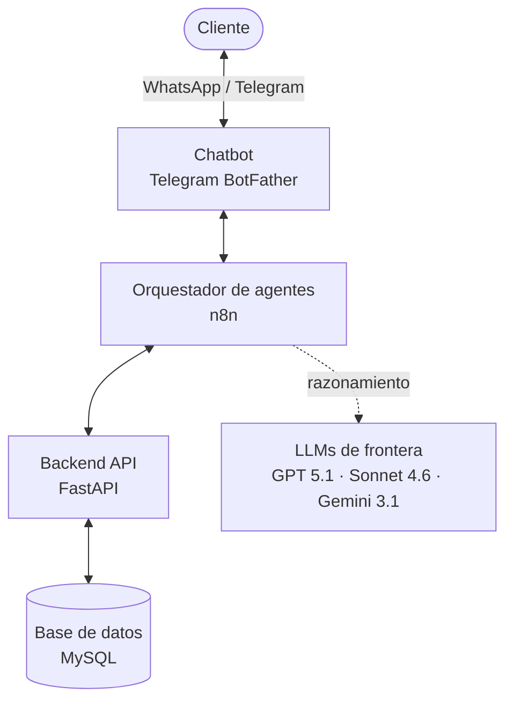

# Motomex — Chatbot de ventas de refacciones con IA

Repositorio con el desarrollo de la prueba técnica para el puesto de Especialista en Automatización e IA de Motomex. El objetivo es implementar un **chatbot con IA** que pueda atender clientes por WhatsApp, vender refacciones directamente, recomendar productos compatibles y cerrar ventas sin intervención humana.

## Tabla de contenidos
- [Caso de estudio](#caso-de-estudio)
- [Arquitectura](#arquitectura)
- [Estructura del repositorio](#estructura-del-repositorio)
- [Componentes](#componentes)
  - [Backend API (`API-server/`)](#backend-api-api-server)
  - [Workflows de n8n (`n8n-workflows/`)](#workflows-de-n8n-n8n-workflows)
  - [Base de datos (`data-base/`)](#base-de-datos-data-base)
- [Documentación técnica](#documentación-técnica)
- [Instalación del backend en entorno local](#instalación-del-backend-en-entorno-local-paso-a-paso)
- [Pruebas](#pruebas)
- [Despliegue](#despliegue)

## Caso de estudio
Una empresa dedicada a la venta de **refacciones automotrices** ha incrementado sus ventas durante el último año. La mayoría de sus ventas y conversaciones con clientes ocurren por **WhatsApp**. Debido al aumento en volumen, los clientes hacen cada vez más preguntas sobre productos, disponibilidad, precios y compatibilidad. Actualmente, la empresa no cuenta con toda esta información estructurada en una base de datos, sino en textos descriptivos de productos.

La dirección de la empresa quiere implementar un **chatbot con IA** que pueda atender clientes por WhatsApp, vender refacciones directamente, recomendar productos compatibles y cerrar ventas sin intervención humana.

### Objetivo
Construir una solución de automatización e IA que permita:
1. Extraer información de productos desde texto en prosa.
2. Convertir esa información en datos estructurados.
3. Almacenar el catálogo en una base de datos.
4. Exponer la información mediante una API.
5. Crear un chatbot en n8n que consulte esa API.
6. Capturar información de nuevos clientes.
7. Registrar leads para seguimiento comercial.

### Entregables
1. Workflow de n8n exportado.
2. Código o configuración de la API.
3. Base de datos o evidencia de almacenamiento.
4. Ejemplo del catálogo estructurado.
5. Evidencia de conversaciones de prueba.
6. Registro de leads generado por el chatbot.
7. Documento breve explicando la arquitectura y la elección del modelo LLM.
8. Preguntas de cierre.

## Arquitectura
La solución está compuesta por cuatro capas desacopladas: el cliente conversa por un canal de chat, **n8n** orquesta la conversación y la inteligencia artificial, la **API** expone la información de negocio, y **MySQL** almacena el catálogo, los leads y las conversaciones.



El flujo del chatbot se diseñó para ser **más determinista que estocástico**: la IA analiza la intención del usuario, pero el recorrido está guiado por nodos condicionales. Toda la información de productos, precios y stock proviene **exclusivamente de la API** (grounding estricto); el LLM tiene prohibido responder con datos propios.

**Modelos LLM y su rol** (un modelo por tarea, para optimizar consumo de tokens y efectividad):

| Modelo | Rol en el flujo |
| --- | --- |
| **GPT 5.1** | Análisis de intención y extracción de las acciones a ejecutar por cada mensaje. |
| **Sonnet 4.6** | Orquestación de las *tools* de búsqueda de productos y resumen de resultados. |
| **Gemini 3.1** | Redacción de la respuesta final al cliente (control de tono y personalidad). |

**Infraestructura en producción:**

- **MySQL** — servidor Apache compartido de Hostinger, administrado desde phpMyAdmin.
- **n8n** — self-hosted en un VPS de Hostinger, orquestado con Coolify.
- **FastAPI** — imagen Docker desplegada con Coolify en el mismo VPS.
- **Chatbot** — bot de Telegram creado con BotFather como interfaz de chat.
- **LLMs** — API keys de OpenAI, Anthropic y Google Gemini (GCP).
- **Notificaciones de error** — vía email (Outlook / M365).

**Entornos de referencia en producción:**

- API REST: <https://api-test-motomex.paosofiam.com/> (documentación interactiva en `/docs`).
- Chatbot de prueba: <https://t.me/paosofiam_motomex_bot>

## Estructura del repositorio
```text
test-motomex-paola-mendoza/
├── API-server/              # Backend REST (FastAPI) — microservicio que consume el chatbot
│   ├── app/                 # Código de la aplicación (router → service → model)
│   │   ├── main.py          # Instancia FastAPI, registro de routers y manejadores
│   │   ├── config.py        # Settings (pydantic-settings, carga .env)
│   │   ├── database.py      # engine, SessionLocal, Base, get_db()
│   │   ├── models/          # Modelos SQLAlchemy
│   │   ├── schemas/         # Schemas Pydantic de request/response
│   │   ├── routers/         # Routers FastAPI (frontera HTTP)
│   │   ├── services/        # Lógica de negocio
│   │   └── core/            # Normalización, resolvers, manejo de errores, mixins
│   ├── migrations/          # Migraciones Alembic (18 tablas)
│   ├── seeders/             # Seeders de catálogos y datos de ejemplo
│   ├── tests/               # Pruebas pytest (modelos, services, endpoints)
│   ├── specs/               # Contratos de diseño (fuente de verdad)
│   ├── Dockerfile           # Imagen de despliegue del backend
│   └── README.md            # Guía detallada del backend
├── n8n-workflows/           # Flujos de n8n exportados (JSON) para importar en n8n
├── data-base/               # Volcado SQL de la base de datos (motomex.sql)
├── CLAUDE.md                # Guía para agentes de IA que trabajan el repo
└── README.md                # Este documento
```

## Componentes
El repositorio agrupa los tres entregables principales del proyecto, cada uno en su carpeta y desplegable de forma independiente.

### Backend API (`API-server/`)
API REST construida con **FastAPI** sobre **MySQL**, con arquitectura de capas `router → service → model`. Es el microservicio que consume el chatbot: expone los endpoints del reto (productos, leads) más los necesarios para la lógica del bot (chats, pre-órdenes). Sigue convenciones estrictas documentadas en `specs/`: dinero en centavos, *soft delete*, errores RFC 7807, conversión de precios a MXN y política Tier 1/2/3 de catálogos.

- Guía de instalación, pruebas y despliegue: [`API-server/README.md`](./API-server/README.md)
- Contratos de diseño: [`API-server/specs/`](./API-server/specs)
- Documentación interactiva (local): `http://localhost:8000/docs`

### Workflows de n8n (`n8n-workflows/`)
Flujos exportados en JSON, listos para importar en una instancia de n8n (Cloud o self-hosted):

| Archivo | Qué hace |
| --- | --- |
| `chatbot-ventas-motomex.json` | Flujo principal del chatbot: gestiona la conversación de venta, analiza intención, consulta la API y redacta respuestas. |
| `Gestion de sesion de chat.json` | Subflujo de gestión de sesión y memoria: registra/consulta el chat y el lead, y limita el contexto entregado a los LLMs. |
| `Extractor de productos.json` | Flujo de extracción del catálogo: convierte texto en prosa en datos estructurados para almacenarlos vía API. |
| `Workflow de error.json` | Flujo de manejo de errores: notifica fallos por email. |

**Cómo importarlos:** en n8n, *Workflows → Import from File* y selecciona el JSON. Las credenciales (API keys de los LLMs, Telegram, base de la API) viajan solo por referencia y deben configurarse en la instancia de destino.

### Base de datos (`data-base/`)
`motomex.sql` es un volcado de la base de datos `motomex` de producción: incluye el esquema de las 18 tablas y sus datos (catálogo estructurado y registro de leads). Sirve como evidencia de almacenamiento y como vía de instalación alterna a las migraciones.

**Cómo importarlo:** en phpMyAdmin, crea la base `motomex` (collation `utf8mb4_unicode_ci`), entra a la pestaña *Importar* y sube `motomex.sql`. Como alternativa a este volcado, la sección de instalación de abajo construye la misma base desde cero con migraciones y seeders.

## Documentación técnica
Las especificaciones del proyecto están divididas en tres documentos complementarios:

- [`contracts.md`](./API-server/specs/contracts.md) — stack, convenciones de nomenclatura, fases de desarrollo, modelos y las **decisiones de lógica de negocio** detrás de la base de datos y los endpoints.
- [`er_diagram.md`](./API-server/specs/er_diagram.md) — diagrama entidad-relación en Mermaid, tablas, columnas, FKs, columnas estándar, valores por defecto y seeders.
- [`endpoints.md`](./API-server/specs/endpoints.md) — tabla de endpoints REST, tipos de recursos, formato de respuestas y errores (RFC 7807), política Tier 1/2/3 de catálogos y política find-or-create/find-or-fail.

Stack: MySQL + FastAPI + SQLAlchemy/Pydantic, consumido por un chatbot de n8n sobre WhatsApp (en el flujo de n8n se implementó Telegram como canal equivalente e intercambiable con WhatsApp).

## Instalación del backend en entorno local (paso a paso)
Esta guía está dirigida a usuario sin contexto previo del proyecto, ni Python, ni el framework que desee correr el proyecto **en local**. Sigue los pasos en orden, de arriba hacia abajo, copiando y pegando cada comando tal cual. Todos los comandos son para **PowerShell en Windows**.

Al terminar tendrás una base de datos llamada `motomex` con todas sus tablas creadas y llenas de datos de ejemplo, lista para que la API la consulte.

### Paso 0 — Pre-requisitos (solo la primera vez)
1. **XAMPP** — un paquete que incluye **MySQL** y **Apache**.
   - Descárgalo de https://www.apachefriends.org e instálalo con las opciones por defecto.
   - Abre el **XAMPP Control Panel** y pulsa **Start** en los renglones de **Apache** y **MySQL** (ambos deben quedar en verde).
   - Comprueba que funciona abriendo en el navegador: http://localhost/phpmyadmin

2. **Python 3.14** — el lenguaje en el que está escrita la API.
   - Descárgalo de https://www.python.org/downloads/ e instálalo. Asegúrate de, en la primera pantalla del instalador, marcar la casilla **"Add Python to PATH"** antes de continuar con la instalación.
   - Verifica que quedó instalado abriendo PowerShell y escribiendo:
     ```powershell
     py -3.14 --version
     ```
     Debe responder algo como `Python 3.14.x`. Si dice "no se reconoce", reinstala marcando "Add Python to PATH".

### Paso 1 — Crear la base de datos vacía
1. Abre http://localhost/phpmyadmin en el navegador.
2. En el menú izquierdo haz clic en **Nueva** / **New**.
3. Escribe el nombre **`motomex`**, en el desplegable de cotejamiento (collation) elige **`utf8mb4_unicode_ci`** y pulsa **Crear** / **Create**
4. Como alternativa con SQL: en la pestaña **SQL** de phpMyAdmin, pega y ejecuta:
> ```sql
> CREATE DATABASE motomex CHARACTER SET utf8mb4 COLLATE utf8mb4_unicode_ci;
> ```

### Paso 2 — Levantar entorno virtual de python (desde cero)
FastAPI de Python requiere de un entorno virtual para poder ejecutarse en el entorno de desarrollo local. A continuación se muestran el paso paso para levantarlo antes de continuar con los siguientes pasos.

Abre PowerShell y **muévete a la carpeta del backend**. Sustituye la ruta por donde hayas descargado el proyecto:

```powershell
cd C:\xampp\htdocs\test-motomex-paola-mendoza\API-server
```

Ahora, en ese orden:

```powershell
# 1. Crear el entorno virtual (crea una carpeta .venv)
py -3.14 -m venv .venv

# 2. Activarlo (a partir de aquí verás "(.venv)" al inicio del renglón)
.\.venv\Scripts\Activate.ps1

# 3. Instalar todas las librerías que el proyecto necesita
pip install -r requirements.txt

# 4. Crear el archivo de configuración a partir de la plantilla
Copy-Item .env.example .env
```

Notas:
- Cuando el entorno está activo, el inicio de cada renglón muestra **`(.venv)`**. Si cierras y vuelves a abrir PowerShell, repite el `cd` y el comando de activación (paso 2) antes de seguir.
- El archivo `.env` ya viene configurado para un **XAMPP recién instalado** (usuario `root` sin contraseña en `localhost:3306`, base `motomex`). Solo edítalo si cambiaste esas credenciales.
- **Si la activación falla** con un error de "ejecución de scripts está deshabilitada", corre esto una vez y reintenta el paso 2:
  ```powershell
  Set-ExecutionPolicy -Scope Process -ExecutionPolicy Bypass
  ```

### Paso 3 — Ejecutar migraciones, una por una
Las **migraciones** son scripts que crean las tablas de la base de datos en el orden correcto. La base de datos de este proyecto cuenta con 18 tablas, y para crearlas una por una se utiliza `alembic upgrade <nombre>`. Ejecuta los comandos **en este orden exacto**; cada uno crea una tabla:

| #  | Comando (revisión)                          | Tabla que crea          | Qué guarda                                            |
| -- | ------------------------------------------- | ----------------------- | ---------------------------------------------------- |
| 1  | `0001_monedas`                              | `monedas`               | Monedas y su tipo de cambio (MXN, USD, EUR)           |
| 2  | `0002_estados`                              | `estados`               | Estados de la república                               |
| 3  | `0003_intenciones`                          | `intenciones_de_compra_de_leads` | Nivel de interés del cliente (baja…completa) |
| 4  | `0004_chat_statuses`                        | `chat_statuses`         | Estados de una conversación                           |
| 5  | `0005_marcas`                               | `marcas`                | Marcas de autos/refacciones                           |
| 6  | `0006_categorias`                           | `categorias`            | Categorías de producto (baterías, balatas…)           |
| 7  | `0007_ciudades`                             | `ciudades`              | Ciudades (ligadas a un estado)                        |
| 8  | `0008_vehiculos`                            | `vehiculos`             | Vehículos por modelo + marca + año                    |
| 9  | `0009_productos`                            | `productos`             | Catálogo de refacciones                               |
| 10 | `0010_leads`                                | `leads`                 | Clientes/prospectos                                   |
| 11 | `0011_chats`                                | `chats`                 | Conversaciones de WhatsApp                            |
| 12 | `0012_pre_ordenes`                          | `pre_ordenes`           | Pre-órdenes de compra                                 |
| 13 | `0013_productos_vehiculos`                  | `productos_vehiculos`   | Qué producto es compatible con qué vehículo           |
| 14 | `0014_productos_ciudades`                   | `productos_ciudades`    | En qué ciudades hay cada producto                     |
| 15 | `0015_productos_categorias`                 | `productos_categorias`  | A qué categorías pertenece cada producto              |
| 16 | `0016_leads_productos`                      | `leads_productos`       | Productos que le interesan a cada cliente             |
| 17 | `0017_leads_vehiculos`                      | `leads_vehiculos`       | Vehículos que tiene cada cliente                      |
| 18 | `0018_pre_ordenes_productos`                | `pre_ordenes_productos` | Renglones de cada pre-orden (producto + cantidad)     |

Con el `(.venv)` activo y dentro de `API-server/`, ejecuta uno por uno:

```powershell
alembic upgrade 0001_monedas
alembic upgrade 0002_estados
alembic upgrade 0003_intenciones
alembic upgrade 0004_chat_statuses
alembic upgrade 0005_marcas
alembic upgrade 0006_categorias
alembic upgrade 0007_ciudades
alembic upgrade 0008_vehiculos
alembic upgrade 0009_productos
alembic upgrade 0010_leads
alembic upgrade 0011_chats
alembic upgrade 0012_pre_ordenes
alembic upgrade 0013_productos_vehiculos
alembic upgrade 0014_productos_ciudades
alembic upgrade 0015_productos_categorias
alembic upgrade 0016_leads_productos
alembic upgrade 0017_leads_vehiculos
alembic upgrade 0018_pre_ordenes_productos
```

Qué esperar:
- Tras cada comando verás una línea tipo `Running upgrade ... -> 0001_monedas, ...`. Eso significa que esa tabla se creó.
- El nombre que va en el comando es el **identificador de la revisión**, no el del archivo. (Ojo con el #3: el comando es `0003_intenciones`, aunque el archivo se llame `0003_intenciones_de_compra_de_leads.py`.)
- En cualquier momento puedes ver hasta dónde vas con `alembic current`, o la lista completa con `alembic history`.

**Atajo opcional:** si prefieres aplicarlas todas de golpe en vez de una por una, basta `alembic upgrade head`. La forma de arriba (una por una) es la recomendada la primera vez para ver cómo se construye cada tabla.

### Paso 4 — Poblar base de datos ejecutando los seeders
Los **seeders** insertan los datos en las tablas. Es seguro repetir cualquiera de ellos porque no duplica datos.

```powershell
# Opción A — TODO: catálogos obligatorios + datos de ejemplo
# (productos, clientes, una pre-orden). Recomendada para probar en local.
python -m seeders.run_all

# Opción B — SOLO los catálogos constantes del sistema
# (monedas, intenciones_de_compra_de_leads, chat_statuses), sin datos de ejemplo.
# Es el mismo seeder que se ejecuta en el entorno de producción.
python -m seeders.seed_catalogs
```

Para montar el entorno local con datos de prueba, usa la **Opción A**.

Para dejar solo los catálogos mínimos que el backend necesita sí o sí, igual que en producción, usa la **Opción B** .

Qué esperar: una lista de las 18 tablas, cada una marcada con `OK` y su número de filas, y al final:
```text
Todas las 18 tablas pobladas correctamente.
```

### Paso 5 — Comprobar que todo quedó bien
1. Confirma la última migración aplicada: Debe mostrar `0018_pre_ordenes_productos (head)`.
   ```powershell
   alembic current
   ```
2. En phpMyAdmin, al hacer clic en la base `motomex`, deben aparecer **19 tablas**: las 18 del proyecto más una llamada `alembic_version` que es de control interno.
3. Revisión rápida de datos: abre la tabla `monedas` y verifica que tiene **MXN (100), USD (1700) y EUR (2300)**. Los precios y tipos de cambio se guardan **en centavos** (ej. `1700` = 17.00), así que se ven como números grandes a propósito.

Si algo salió mal y quieres rehacer todo limpio:
```powershell
alembic downgrade base
```

Esto borra todas las tablas del proyecto (deja la base vacía). Para un reinicio total, elimina la base `motomex` desde phpMyAdmin y vuelve al **Paso 1**. (Nota: los seeders no borran datos; por eso, para empezar limpio, primero hay que vaciar la base.)

### Paso 6 — Levantar servidor local y consultar el backend
Arrancar la API con el `(.venv)` activo y dentro de `API-server/`:
```powershell
uvicorn app.main:app --reload
```

Esto enciende la API en **http://localhost:8000**. `--reload` hace que se reinicie sola al guardar cambios en el código. **Deja esta ventana de PowerShell abierta**: mientras siga abierta, el servidor está vivo (verás los registros de cada petición). Para apagarlo, pulsa **Ctrl + C** en esa ventana.

Comprueba que responde en el navegador:
- http://localhost:8000/health → debe devolver `{"status":"ok"}`. Confirma que el servidor está vivo.
- http://localhost:8000/docs → **Swagger UI**. Es la forma **más fácil** de explorar la API sin escribir comandos: lista todos los endpoints y, con el botón **"Try it out"**, puedes mandar peticiones de prueba desde el navegador. **Empieza por aquí.**
- http://localhost:8000/redoc → la misma documentación, en formato de solo lectura.

Ejemplos de **lectura** (`GET`):
```powershell
# Listar todos los productos
Invoke-RestMethod http://localhost:8000/productos

# Filtrar productos por marca
Invoke-RestMethod "http://localhost:8000/productos?marca=Nissan"

# Filtrar por precio mínimo (en centavos: 100000 = $1,000.00)
Invoke-RestMethod "http://localhost:8000/productos?precio_minimo=100000"

# Ver un producto por su id
Invoke-RestMethod http://localhost:8000/productos/1

# Buscar el chat de un cliente por su id de WhatsApp
Invoke-RestMethod "http://localhost:8000/leads?chat_whatsapp_id=521812345678"
```

Ejemplo de **creación** (`POST` con cuerpo JSON) — registrar un nuevo cliente (lead):

```powershell
$cuerpo = @'
{
  "chat_whatsapp_id": "521812345678",
  "nombre_whatsapp": "Juan",
  "telefono": "+5218112345678",
  "nombre": "Juan Pérez",
  "ciudad": "Monterrey",
  "productos_interes": ["L-24"],
  "vehiculo": [{"modelo": "Versa", "marca": "Nissan", "anio": 2015}],
  "direccion_envio": "Av. Siempre Viva 123",
  "intencion_de_compra_id": 3
}
'@

Invoke-RestMethod -Method Post -Uri http://localhost:8000/leads `
  -ContentType "application/json" -Body $cuerpo
```

Si prefieres `curl` (también disponible en Windows), el equivalente del primer GET es:
```powershell
curl http://localhost:8000/productos
```

**Notas de lógica de negocio del proyecto:**

- El **servidor** (Paso 6) y los comandos de consulta van en **ventanas separadas**: la del servidor queda "ocupada" mostrando registros.
- Los **precios** en las respuestas vienen **en centavos**: `189900` significa $1,899.00. Quien consume la API (el chatbot) los convierte a pesos al mostrarlos.
- La lista completa y siempre actualizada de endpoints, con sus parámetros y respuestas, está en **http://localhost:8000/docs**. Para el detalle del contrato, ver [`API-server/specs/endpoints.md`](./API-server/specs/endpoints.md).

## Pruebas
El **backend** cuenta con una suite de pruebas con **pytest** (modelos, services y endpoints) que corre contra una base MySQL de pruebas real (`motomex_test`). Los flujos de **n8n** se validan de extremo a extremo desde la interfaz de chat conectada al bot.

Para ejecutar la suite del backend, ver [Pruebas](./API-server/README.md#pruebas) en el README del backend.

## Despliegue
El proyecto **no se despliega como una sola unidad**; cada componente vive y se despliega por separado:

- **Backend API** → como **microservicio Docker**. En producción se construye la imagen desde el `Dockerfile` y se despliega con **Coolify** en un VPS de Hostinger; el contenedor corre las migraciones al arrancar. Detalle paso a paso en [`API-server/README.md`](./API-server/README.md#despliegue-en-producción-docker).
- **Workflows de n8n** → se **importan y ejecutan** en una instancia de n8n (self-hosted con Coolify, o n8n Cloud). No se despliega código: se importa cada JSON y se configuran sus credenciales en la instancia de destino.
- **Base de datos** → corre en un servidor **MySQL** gestionado aparte (en producción, el MySQL de Hostinger administrado desde phpMyAdmin). El esquema se crea con las migraciones del backend o importando `data-base/motomex.sql`.

Para la guía local equivalente (sin Docker, con XAMPP), ver [Instalación del backend en entorno local](#instalación-del-backend-en-entorno-local-paso-a-paso).